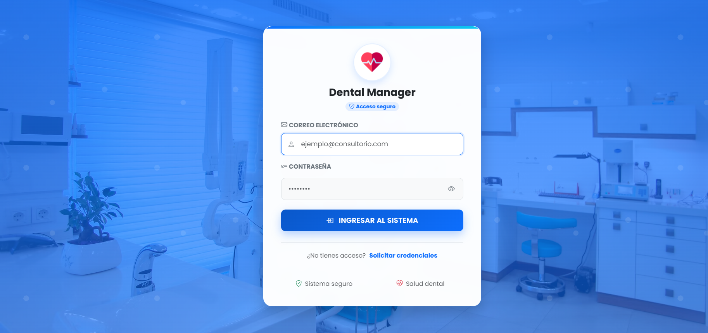
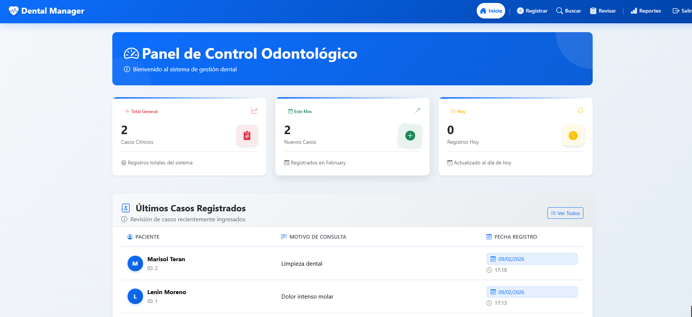
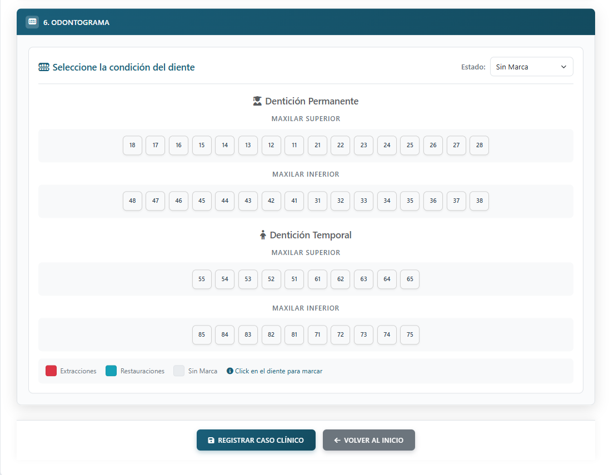
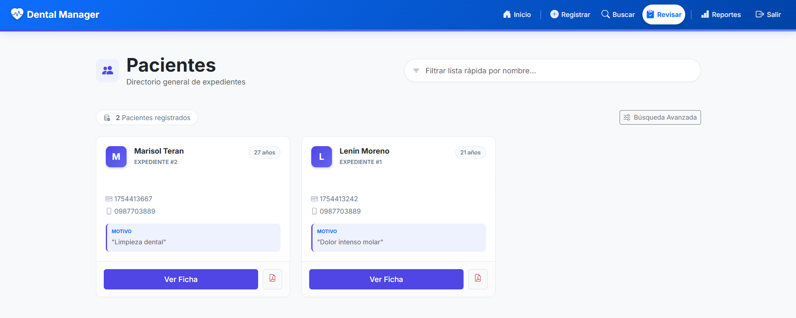
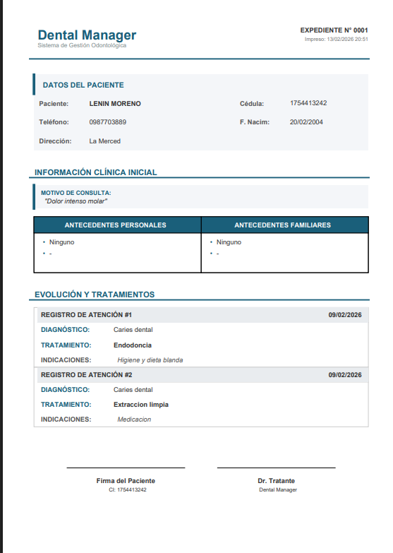
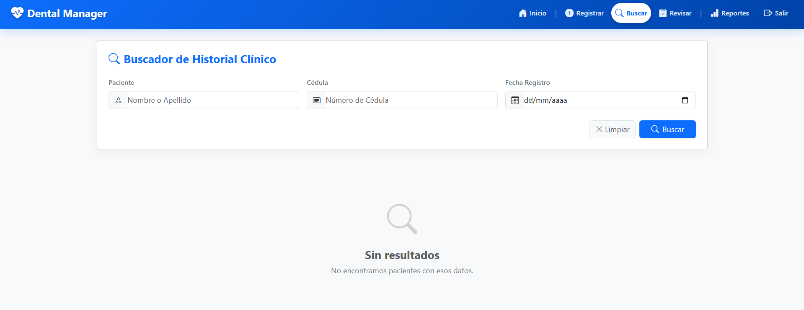

# 🦷 DentalManager

## Sistema de Gestión Integral para Clínicas Odontológicas

---

### 🎯 En una frase

Dental Manager es un sistema web completo que automatiza la gestión de pacientes, tratamientos y reportes en clínicas dentales, reduciendo el tiempo de administración y mejorando la atención al paciente.

---

### 🚀 ¿Por qué importa este proyecto?

Las clínicas odontológicas tradicionales enfrentan desafíos diarios:
- **Pérdida de tiempo** en papeleo y registros manuales
- **Desorganización** de historiales médicos
- **Dificultad** para generar reportes y estadísticas
- **Sin acceso centralizado** a la información de pacientes

**Dental Manager resuelve estos problemas** proporcionando una plataforma digital que centraliza toda la operación de la clínica.

---

### 📊 Impacto del proyecto

| Métrica | Antes | Después |
|---------|-------|---------|
| Tiempo en registrar un paciente | 15-20 min | 2-3 min |
| Búsqueda de historiales | 5-10 min | Instantáneo |
| Generación de reportes | Manual (horas) | Automatizado (segundos) |
| Acceso a estadísticas | No disponible | En tiempo real |

---

### ✨ Características principales

#### 1️⃣ Gestión completa de pacientes
- Registro digital de datos personales
- Historial médico completo
- Búsqueda rápida y filtrada
- Seguimiento a largo plazo

#### 2️⃣ Casos clínicos especializados
- Documentación estructurada de tratamientos
- Motivo de consulta y antecedentes
- Plan de tratamiento personalizado
- Estado del caso (en progreso, completado, derivado)

#### 3️⃣ Odontograma digital
- Visualización gráfica del estado dental
- Registro de piezas presentes y ausentes
- Marcas visuales por condición (caries, restauración, extracción)
- Evolución visual del tratamiento

#### 4️⃣ Historias clínicas detalladas
- Diagnósticos precisos con códigos
- Tratamientos realizados con descripciones
- Indicaciones post-tratamiento para pacientes
- Notas de evolución y seguimiento

#### 5️⃣ Reportería inteligente
- Reportes individuales por paciente
- Reportes consolidados de la clínica
- Estadísticas de tratamientos más comunes
- Exportación de datos para análisis

#### 6️⃣ Panel de control (Dashboard)
- Resumen de actividad diaria
- Citas y casos pendientes
- Métricas clave de la clínica
- Vista rápida de pacientes recientes

#### 7️⃣ Seguridad empresarial
- Autenticación segura con sesiones
- Control de acceso por roles
- Datos encriptados
- Registro de actividades

---

---

### 📸 Galería del Sistema

Una vista rápida a las funcionalidades principales de Dental Manager:

| **Acceso y Control** | **Gestión Clínica** |
|:---:|:---:|
| **Inicio de Sesión Seguro**<br> | **Panel de Control (Dashboard)**<br> |

| **Corazón del Sistema** | **Historia Clínica** |
|:---:|:---:|
| **Odontograma Interactivo**<br> | **Gestión de Casos**<br> |

| **Potencia y Resultados** | **Herramientas** |
|:---:|:---:|
| **Reportes Profesionales PDF**<br> | **Búsqueda Avanzada**<br> |

---

### 🛠️ Stack tecnológico

```
Frontend:      HTML5, CSS3, JavaScript
Backend:       PHP 8.1+
Framework:     CodeIgniter 4
Database:      MySQL
Servidor:      Apache/Nginx (XAMPP)
Control:       Git/GitHub
```

---

### 🧠 Habilidades demostradas

#### Backend
- ✅ Programación orientada a objetos en PHP
- ✅ Patrón de arquitectura MVC
- ✅ Conexión y consultas a bases de datos MySQL
- ✅ Validación y sanitización de datos
- ✅ Manejo de sesiones y autenticación
- ✅ Desarrollo de APIs y controladores

#### Frontend
- ✅ HTML semántico y accesible
- ✅ CSS con diseño responsive
- ✅ JavaScript para interactividad
- ✅ Integración frontend-backend

#### Base de datos
- ✅ Diseño de esquemas relacionales
- ✅ Consultas SQL optimizadas
- ✅ Normalización de datos
- ✅ Procedures y funciones

#### General
- ✅ Control de versiones con Git
- ✅ Documentación técnica
- ✅ Resolución de problemas
- ✅ Código limpio y mantenible

---

### 📁 Estructura del proyecto

```
SisOdontoMandy/
├── app/
│   ├── Config/          → Configuraciones del framework
│   ├── Controllers/      → Lógica de negocio (Home, CCasos, Reportes, Admin)
│   ├── Models/          → Acceso a datos (ModeloGeneral)
│   ├── Views/           → Interfaces de usuario (PHP templates)
│   └── Helpers/         → Funciones utilitarias
├── Img/                 → Imágenes del proyecto (screenshots, logos)
├── public/
│   ├── css/             → Estilos del sistema
│   └── [assets]        → Imágenes, JS, etc.
└── system/              → Framework CodeIgniter 4
```

---

### 🔑 Módulos principales

| Módulo | Archivo clave | Descripción |
|--------|---------------|-------------|
| Login | `Home.php` | Autenticación de usuarios |
| Dashboard | `VistaDashboard.php` | Panel principal |
| Pacientes | `VistaRegistro.php` | Registro de pacientes |
| Casos | `CCasos.php` + `VistaCC.php` | Gestión de casos clínicos |
| Odontograma | `VistaSelectCasos.php` | Visualización dental |
| Reportes | `Reportes.php` | Generación de informes |
| Admin | `CAdmin.php` | Administración del sistema |

---

### 💡 Lo que aprendí

1. **Diseñar soluciones reales** - Entender necesidades de usuarios y traducirlas en funcionalidades
2. **Arquitectura escalable** - Aplicar patrones como MVC para proyectos mantenibles
3. **Seguridad primero** - Implementar protecciones contra vulnerabilidades comunes
4. **Experiencia de usuario** - Crear interfaces intuitivas para usuarios no técnicos
5. **Gestión de proyecto** - Planificar, ejecutar y entregar un sistema completo

---

### 📈 Próximos pasos (v2.0)

- [ ] Citas y agenda automática
- [ ] Recordatorios por WhatsApp/SMS
- [ ] Portal del paciente
- [ ] App móvil
- [ ] Multiclinica (SaaS)


### 🚀 Cómo ejecutar el proyecto

```bash
# Requisitos
- PHP 8.1+
- MySQL
- Composer
- XAMPP/WAMP

# Instalación
1. Clonar el repositorio
2. composer install
3. Crear base de datos 'odontomandy_db'
4. Importar schema SQL
5. Configurar .env
6. Acceder a http://localhost/SisOdontoMandy/
```

---

### 📬 Contacto

¿Interesado en el proyecto o en trabajar juntos?

- **GitHub:** [LENINMOREN013](https://github.com/LENINMOREN013)
- **Email:** mlenin922@gmail.com
- **LinkedIn:** [Lenin Moreno](https://www.linkedin.com/in/lenin-moreno/)

---

